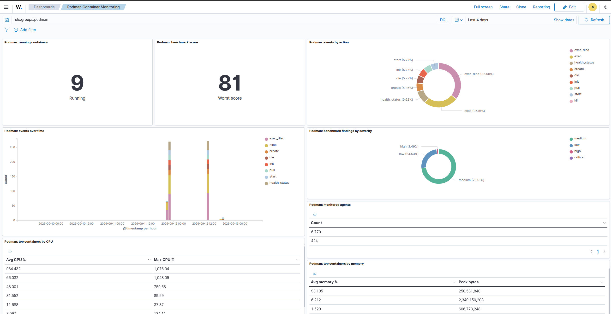
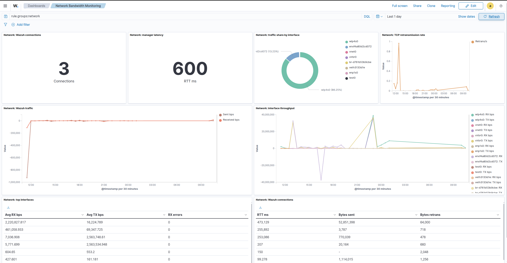
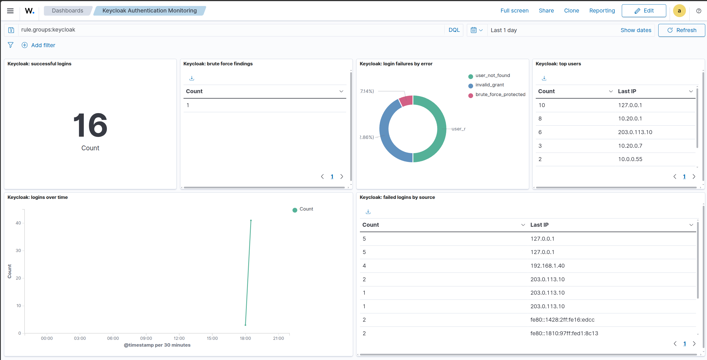
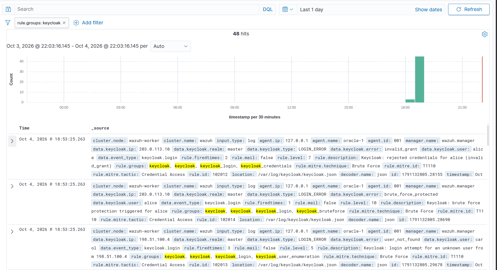

# Wazuh Podman, Network Bandwidth & Keycloak Monitoring - Decoders/Rules/Dashboards/Benchmark

Wazuh contribution to integrations in the sense of Podman container lifecycle monitoring, network bandwidth monitoring and Keycloak authentication monitoring.
As of the moment of contributing/writing, Wazuh has no out-of-box (documented) integrations for these needs, eventhough they are highly applicable in today's industry. 

Each integration ships its own collector, decoders, rules, dashboards and tests, and can be loaded into any Wazuh
manager. Please refer to the details in the `network`, `podman` and `keycloak` folders for a detailed overview of the decoders/rules/dashboards and how to load them depending on the way you deployed the Wazuh stack.

## Podman container monitoring

Collects container lifecycle events, resource usage and a security benchmark
from the Podman API.

* Lifecycle: create, init, start, stop, die, destroy, exec, kill, oom,
  health_status, plus image, volume and network events
* Metrics: CPU, memory, network, block I/O and PID counters per container
* Benchmark: privileged, host namespaces, runtime socket mounts, capabilities,
  missing limits, writable rootfs, sensitive mounts and more
* Startup and uptime timing derived from the event stream
* Ten visualizations and one dashboard

See `integrations/podman/README.md`.

## Network bandwidth monitoring

Collects host network counters and the TCP sockets used by Wazuh.

* Per-interface throughput and error counters
* Wazuh connection bytes, retransmissions and RTT
* Aggregated agent-manager traffic and rates
* TCP segment and retransmission counters
* ICMP latency to the manager
* Eight visualizations and one dashboard

See `integrations/network/README.md`.

## Keycloak authentication monitoring

Watches identity flows through the built-in jboss-logging event listener,
plus optional canonical JSON payloads.

* Successful logins and logouts
* Login failures with their Keycloak error reason
* User enumeration and brute force protection
* Rejected credentials and disabled accounts
* Admin operations on users, roles and realms
* Six visualizations and one dashboard

See `integrations/keycloak/README.md`.











## Loading an integration

Each integration provides a collector, an agent configuration snippet and an
index template. Apply the template before the first alert is indexed, add the
localfile to the agent, and import the dashboard ndjson. The integration
README files contain the exact commands.

Decoders that must run before the built-in JSON decoder are installed under
`ruleset/decoders/` with a prefix that sorts before `0006-json_decoders.xml`
(for example `0005a-podman_decoders.xml`).

## Testing

```
python3 integrations/podman/tests/test_monitoring.py
python3 integrations/network/tests/test_network.py
python3 integrations/keycloak/tests/test_keycloak.py
```

The podman and network suites require a running Wazuh manager container and an
enrolled agent on the same host. The keycloak suite spawns its own disposable
Keycloak container and points its indexer and dashboard checks at the master
through `WAZUH_INDEXER_URL` and `WAZUH_DASHBOARD_URL`.

## Future work...

* Provisioning and attestation for AI agent deployments, including LiteLLM and
  Langfuse observability.

## License and credits

This repository is licensed under GPLv2, see `LICENSE`.

Wazuh is developed by Wazuh, Inc. and licensed under GPLv2. This project
integrates with Wazuh, uses the official Wazuh agent container image, and its
agent configuration is based on the Wazuh agent default configuration. Wazuh
is a trademark of Wazuh, Inc. All other code in this repository is original.

